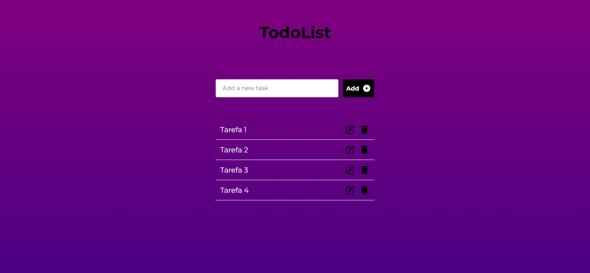

# Todo List Full Stack



## Descrição

Este é um projeto pessoal de um Todo List full stack desenvolvido com React, Vite, CSS no frontend e Java com Spring Boot e banco de dados H2 no backend.

## Funcionalidades

- Adição, edição, exclusão e marcação de conclusão de tarefas.
- Persistência de dados utilizando um banco de dados H2 embarcado.
- Interface de usuário responsiva e intuitiva.

## Tecnologias Utilizadas

### Frontend

- [React](https://reactjs.org/)
- [Vite](https://vitejs.dev/)
- CSS

### Backend

- Java
- [Spring Boot](https://spring.io/projects/spring-boot)
- Banco de Dados H2 (embarcado)

## Pré-requisitos

- Node.js
- JDK (Java Development Kit)
- IDE de sua preferência (como IntelliJ IDEA, Eclipse, etc.)

## Instalação e Execução

Siga estas etapas para rodar o projeto na sua máquina local:

### Backend (Spring Boot)

1. **Clone o repositório:**

   ```bash
   git clone https://github.com/seu-usuario/todo-list-fullstack.git
   cd todo-list-fullstack/backend

2. **Importe o projeto na sua IDE** e aguarde a importação das dependências do Maven.

3. **Execute o aplicativo Spring Boot.** Isso iniciará o servidor backend na porta padrão **8080**.

4. **Verifique se o backend está funcionando** acessando **http://localhost:8080** no seu navegador. Você deve ver uma página padrão do Spring indicando que o servidor está rodando.

### Frontend (React)

1.**Abra um novo terminal** na raiz do projeto (ou na pasta onde deseja colocar o frontend).

2. **Navegue até a pasta frontend:**

   ```bash
   cd frontend

3. **Instale as dependências do projeto:**

   ```bash
   npm install

4. **Após a instalação das dependências, inicie o servidor de desenvolvimento:**

   ```bash
   npm run dev

5. **O frontend será executado e estará disponível, e você deve verificar o caminho.**

6. 


  
